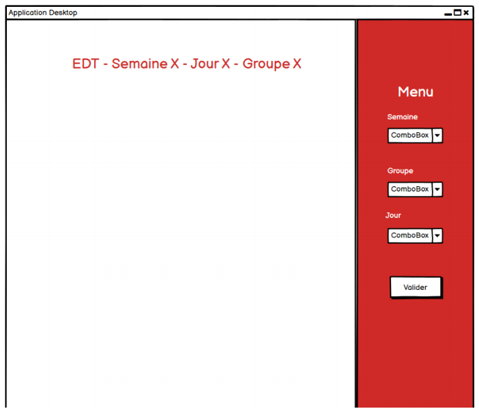
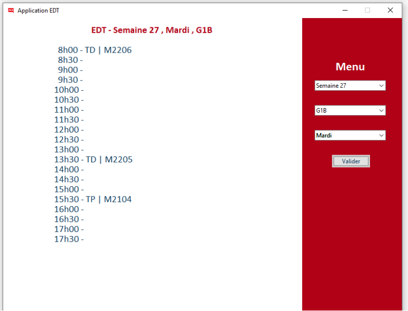

# Application de Bureau
*L'application permet à un utilisateur de récuperer les cours de la journée*

Dans le cadre du projet tuteuré [disponible ici](https://github.com/xernois/edt-bot-iut), mon groupe et moi meme avons développé une API permettant de recuperer et comprendre notre EDT. J'ai fait le choix de développer une application de bureau avec une interface humain-machine afin de montrer une utilisation possible de l'API. J'ai choisi une fois de plus le langage python pour développer l’application. Avant même de commencer le code, j'ai composé une maquette de l’application pour connaître les différents composants et leur position. Pour conserver une certaine cohérence, la charte graphique de l’application reprend celle du site de l’université, www.unilim.fr.

La maquette faite, j'ai pu commencer la programmation. Pour la clarté du code et sa modularité,
il a été conçu en 3 couches logicielles distinctes basé sur le modèle MVC :
- La couche présentation : l’interface visuelle que voit l’utilisateur
- La couche application : la partie logique de l’application
- La couche de données : manipulation des données et transfère entre le fichier source et la couche application
Ces trois couches logicielles sont représentées généralement par les symboles. Ces 3 symboles sont associés aux stéréotypes de Jacobson utilisés en UML.

Tout d’abord, j'ai développé la partie graphique en plaçant les labels et bouton. Puis, j'ai développé l’interaction qu’avait le bouton. La difficulté était de gérer les erreurs éventuelles et de les signaler à l’utilisateur le plus clairement possible. Une fois l’API en place, j'ai modifié légèrement le code qui permettait jusqu’à lors de lire un fichier se trouvant dans le dossier pour qu’il puisse réaliser des requêtes vers l’API. Pour effectuer, ces requêtes la librairie requests en python convenait parfaitement. Finalement, dans sa version finale l’application bureau ressemble à la figure ci-arès.

